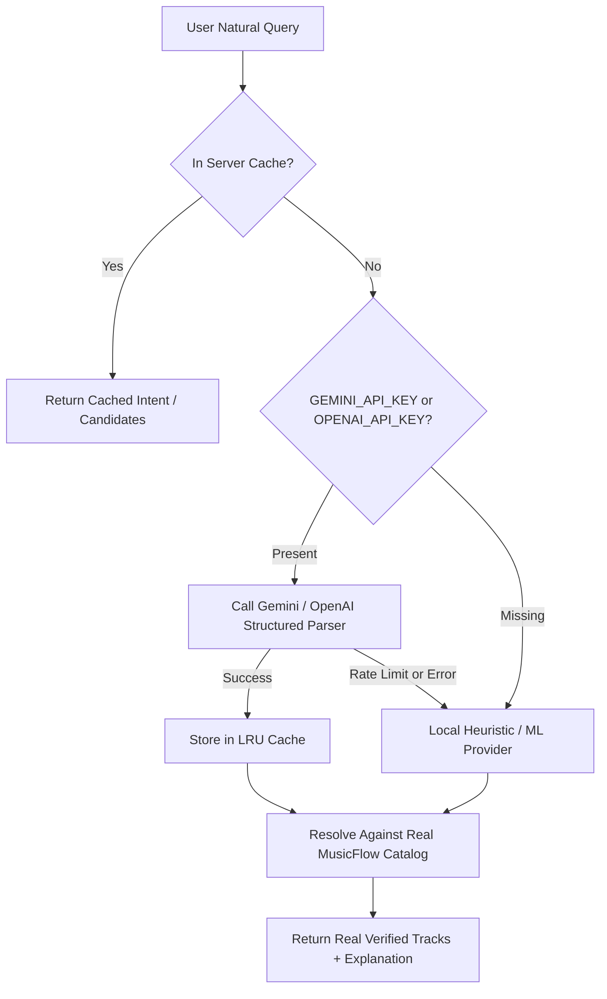

# MusicFlow V2 — AI Music Core Architecture Specification

**Author**: MusicFlow Core Engineering Team  
**Date**: September 9, 2026  
**Status**: Approved Specification / Phase A Architectural Blueprint  

---

## 1. Audit of Existing Systems

### 1.1 Existing Search Pipeline
- **API**: `app/api/search/route.ts` executes parallel calls to `searchSongs`, `searchCanonicalArtists`, and `searchAlbums`.
- **Limitation**: Pure keyword matching. Queries like `"play sad Arijit songs"` or `"Bengali songs for late night driving"` are sent verbatim to YouTube Music, which matches literal keywords rather than understanding mood, genre, era, or activity.
- **Data Available**:
  - `query` string
  - `type` filter (`"songs" | "artists" | "albums" | "all"`)
  - Search suggestions via `app/api/search/suggestions/route.ts`

### 1.2 Existing Recommendation Pipeline
- **API**: `app/api/recommendations/route.ts` calls `computeHybridRecommendations` in `lib/recommendations-engine.ts`.
- **Limitation**: Basic linear math scoring based on artist frequency. Doesn't understand user taste profiles, languages, moods, musical eras, novelty balance, or explainability.
- **Data Available**:
  - `likedSongs`: `Track[]`
  - `recentSongs`: `Track[]`
  - `history`: `ListeningHistoryEntry[]` (duration, completion %)
  - `playlists`: `Playlist[]`
  - `followedArtists`: `FollowedArtist[]`
  - `savedAlbums`: `SavedAlbum[]`

### 1.3 Existing Smart Queue Pipeline
- **Hook**: `hooks/useSmartQueue.ts` detects when playback approaches the end of the queue and fires `searchSongs(`${artist} Similar Hit Songs`)`.
- **Limitation**: Re-queries the exact same artist with a static query. Lacks diversity, doesn't penalize skips, doesn't respect taste profile, and may produce repetitive artist loops.

---

## 2. Missing Components for Genuine AI Core

1. **Natural Language Semantic Intent Extraction**:
   Extracting structured search intent (`artist`, `genre`, `language`, `mood`, `era`, `activity`, `intent`) from freeform conversational queries.
2. **User Taste Profile Vectorization & Modeling**:
   Aggregating listening signals (likes, full plays, skips, replay count, language distribution, genre affinity) into a normalized taste profile.
3. **Pluggable AI Provider Layer (`AIProvider`)**:
   An extensible abstraction supporting cloud LLMs (Gemini, OpenAI) with zero-config local heuristic ML fallback.
4. **Context-Aware Queue Candidate Ranking Engine**:
   Coherence scoring, artist repetition penalty, skip-fatigue suppression, and controlled novelty.
5. **Explainability Engine**:
   Transparent, user-facing explanations for why a track was recommended ("Because you listen to Arijit + romantic Hindi songs").
6. **Negative Feedback Tracking**:
   Capturing premature track skips (< 30 seconds or < 20% completion) in Zustand and feeding into the AI ranking signals.

---

## 3. Proposed Directory Architecture

```
lib/ai/
  ├── types.ts                     # Core AI data structures & contracts
  ├── providers/
  │   ├── base.ts                  # AIProvider interface
  │   ├── gemini.ts                # Google Gemini cloud provider
  │   ├── openai.ts                # OpenAI cloud provider
  │   ├── local.ts                 # Zero-config local heuristic/ML provider
  │   └── index.ts                 # Provider factory & fallback manager
  ├── search/
  │   └── ai-search-service.ts     # Natural language intent extraction & resolution
  ├── profile/
  │   └── taste-profile-service.ts # Builds structured taste profiles from user signals
  ├── recommendations/
  │   └── ai-recommendation-service.ts # Personalized recommendation & explainability
  └── queue/
      └── ai-smart-queue-service.ts# Intelligent queue transition & coherence ranking
```

---

## 4. Provider Interface Contract

```typescript
export interface SearchIntent {
  rawQuery: string;
  artist?: string;
  song?: string;
  album?: string;
  genre?: string;
  language?: string;
  mood?: string;
  era?: string;
  activity?: string;
  popularity?: "popular" | "underground" | "any";
  similarityTarget?: string;
  intent: "music_discovery" | "specific_playback" | "artist_focus" | "mood_vibe" | "similar_tracks";
  searchKeywords: string[];
}

export interface UserTasteProfile {
  topArtists: Array<{ name: string; weight: number }>;
  topGenres: Array<{ genre: string; weight: number }>;
  topLanguages: Array<{ language: string; weight: number }>;
  preferredMoods: string[];
  preferredEras: string[];
  skippedTrackIds: string[];
  completedTrackIds: string[];
  replayTrackIds: string[];
  totalInteractions: number;
}

export interface ScoredRecommendation extends Track {
  score: number;
  recommendationReason: string;
  matchSignals: {
    artistAffinity: number;
    genreAffinity: number;
    moodAffinity: number;
    noveltyScore: number;
    repetitionPenalty: number;
  };
}

export interface AIProvider {
  name: string;
  isAvailable(): boolean;
  analyzeSearchIntent(query: string, context?: { recentTracks?: string[] }): Promise<SearchIntent>;
  generateRecommendationKeywords(profile: UserTasteProfile, limit?: number): Promise<Array<{ query: string; reason: string }>>;
  rankCandidates(
    candidates: Track[],
    context: {
      currentTrack?: Track;
      profile: UserTasteProfile;
      recentVideoIds: string[];
      targetMood?: string;
    }
  ): Promise<ScoredRecommendation[]>;
}
```

---

## 5. Fallback & Cost Optimization Strategy



1. **Zero Fake Tracks Guarantee**: The AI model extracts intent and generates search parameters; all songs and audio streams are resolved strictly against MusicFlow's real catalog (`lib/canonical-music.ts` and `lib/ytmusic.ts`).
2. **Server-Side Credentials**: No API keys are ever leaked to the client browser.
3. **Deterministic Fallback**: If an external LLM fails or is unconfigured, the `LocalAIProvider` natural language parser processes the query without user disruption.
4. **Caching & Debounce**: Intent extraction results are cached in-memory for 24 hours to minimize API invocations. Search inputs are debounced by 350ms.

---

## 6. API Route Additions

1. **`POST /api/ai/search`**:
   - Input: `{ query: string, context?: { recentArtists?: string[] } }`
   - Output: `{ intent: SearchIntent, results: Track[], artists: Artist[], albums: Album[], explanation: string }`
2. **`POST /api/ai/recommendations`**:
   - Input: `{ likedSongs: Track[], history: ListeningHistoryEntry[], recentSongs: Track[], skips: string[] }`
   - Output: `{ recommendations: ScoredRecommendation[], tasteProfile: UserTasteProfile }`
3. **`POST /api/ai/smart-queue`**:
   - Input: `{ currentTrack: Track, queue: Track[], recentVideoIds: string[], skips: string[], likedSongs: Track[] }`
   - Output: `{ nextTracks: Track[], coherenceScore: number }`

---

## 7. Data Privacy & Storage Requirements

- **Guest Users**: Taste profiles and skip tracking are stored in client-side localStorage under key `musicflow-taste-profile`.
- **Authenticated Users**: Taste profile metrics sync to Supabase `user_preferences` table if authenticated.
- **Zero Cross-User Leakage**: Store reset action (`resetUserLibrary`) completely purges in-memory taste profile on logout.
- **No Sensitive Data**: Profiles strictly store musical tokens (genres, artist names, language codes, track IDs), never PII or location.

---

## 8. Preserved Architectural Locks
- Samsung Internet background audio anchor (`audio-anchor.ts`, `useMediaSession.ts`) remains **untouched and frozen**.
- YouTube audio streaming iframe and policy compliance remain unchanged.
- PWA service worker and manifest remain intact.
